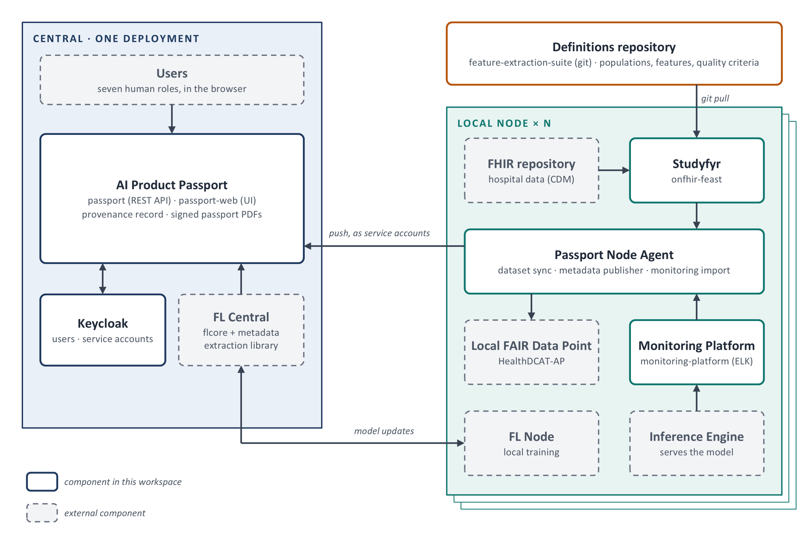
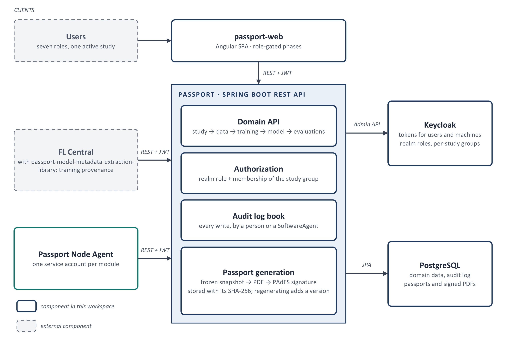
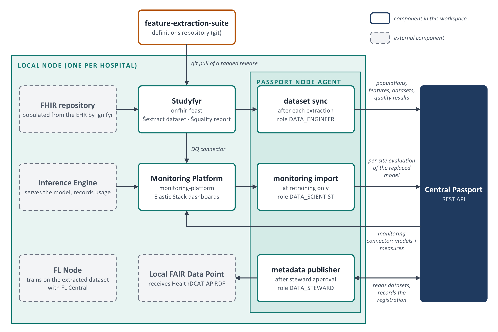

# AI Product Passport: components and how they fit together

Federated architecture · data model v2.7

The same content is available as a Word document, [`component-overview.docx`](component-overview.docx).
The figures are drawn in [`figures.pptx`](figures.pptx) and exported to the PNGs below. Edit the
PowerPoint and re-export when a figure changes.

## 1. Overview

The AI Product Passport records the provenance of an AI model (study, data, training, model and
evaluations) and issues it as a digitally signed, versioned PDF. It is deployed once, centrally. Each
participating hospital runs a local node that keeps patient data inside the hospital and sends only
metadata and aggregates to the central Passport.

*Figure 1. System overview: one central platform, one local node per hospital, one shared definitions
repository. Solid boxes are components in this workspace, dashed grey boxes are external.*

Three rules hold the architecture together:

- **Node to central only.** Every integration starts at the node. The central platform never calls into a
  hospital and holds no hospital credentials.
- **One identity per machine.** Each machine client is its own Keycloak service account, so the audit log
  names the software agent behind every write.
- **Shared definitions, local execution.** Cohorts, features and quality criteria live in one git
  repository. Each node runs a tagged release, and the Passport records the `(url, version)` that was
  executed.

## 2. Central platform

*Figure 2. Central platform: clients, the Passport API and its supporting services.*

- **passport-web** is the UI people work in: one role-gated phase per role, scoped to the active study.
- **passport** is the REST API. Every call is checked against the caller's role and study-group
  membership, and every write is recorded in the audit log book.
- **Passport generation** freezes a snapshot of the model's provenance, renders it to PDF from the
  passport-web export page, signs it (PAdES) and stores the bytes with their SHA-256. A passport is never
  rewritten; regenerating creates the next version.
- **Keycloak** issues tokens to people and machines and holds one group per study, with a subgroup per
  study role.
- **PostgreSQL** holds the domain data, the audit log and the stored passports.
- **FL Central** reports training provenance (algorithm, learning process, model, evaluation runs)
  through the metadata extraction library.

## 3. Local node

*Figure 3. Local node: the four data flows and the Passport Node Agent modules that carry them to the
central Passport.*

- **Extraction.** Studyfyr runs the definitions against the FHIR repository and produces a dataset and
  its quality report. Dataset sync writes the populations, features, dataset and quality results to the
  Passport.
- **Training.** The FL Node trains on the extracted dataset; FL Central aggregates and reports to the
  Passport.
- **Monitoring.** The Inference Engine feeds predictions and feedback to the Monitoring Platform. At
  retraining, monitoring import sends the per-site evaluation of the replaced model. The DQ connector and
  the monitoring connector only feed dashboards.
- **Publication.** After a Data Steward approves, the metadata publisher writes the dataset as
  HealthDCAT-AP RDF to the local FAIR Data Point and records the registration in the Passport.

Every node agent module can be re-run safely: each write is matched on its domain identity first, so a
repeated run completes the work instead of duplicating it.

## 4. Component summary

| Component | Repository | Runs at | Main duty |
|---|---|---|---|
| Passport backend | [`passport`](https://github.com/AI4HF/passport) | Central | REST API, authorization, audit log book, passport generation and signing |
| Passport UI | [`passport-web`](https://github.com/AI4HF/passport-web) | Central | Web UI for every role; also the export page the PDF is rendered from |
| Keycloak | `passport` (realm configuration) | Central | Identity for people and machines; per-study groups carry the study roles |
| Metadata extraction library | [`passport-model-metadata-extraction-library`](https://github.com/AI4HF/passport-model-metadata-extraction-library) | Central, inside FL Central | Pushes training provenance from sklearn, Keras and PyTorch pipelines |
| Passport Node Agent | [`passport-node-agent`](https://github.com/AI4HF/passport-node-agent) | Node | Dataset sync, monitoring import, metadata publisher |
| Studyfyr | `onfhir-feast` (SRDC GitLab) | Node | Runs the definitions on FHIR data: dataset extraction, statistics, `$quality` |
| Definitions | [`feature-extraction-suite`](https://github.com/DataTools4Heart/feature-extraction-suite) | Git, pulled by nodes | Populations, feature groups and their pipelines, feature sets, quality criteria |
| Monitoring Platform | [`monitoring-platform`](https://github.com/AI4HF/monitoring-platform) | Node | Elastic Stack: predictions, feedback, data quality and drift dashboards |
| Monitoring connector | [`passport-monitoring-platform-connector`](https://github.com/AI4HF/passport-monitoring-platform-connector) | Node, scheduled | Copies models and evaluation measures from the Passport to the dashboards |
| DQ connector | [`data-quality-monitoring-platform-connector`](https://github.com/AI4HF/data-quality-monitoring-platform-connector) | Node | Sends `$quality` results to the dashboards |
| Feast connector | [`passport-onfhir-feast-connector`](https://github.com/AI4HF/passport-onfhir-feast-connector) | Not deployed | Superseded prototype of dataset sync, kept for reference |

**External components**, not developed in these repositories: the FHIR repository and Ignifyr (EHR to
FHIR mapping), FL Central and FL Node (flcore, on Flower), the Inference Engine, the local FAIR Data
Point, and the central metadata catalogue (integration not yet decided).
