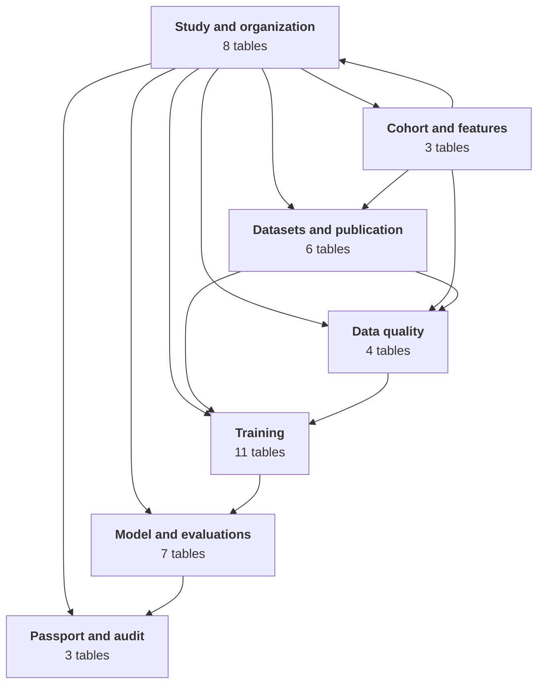
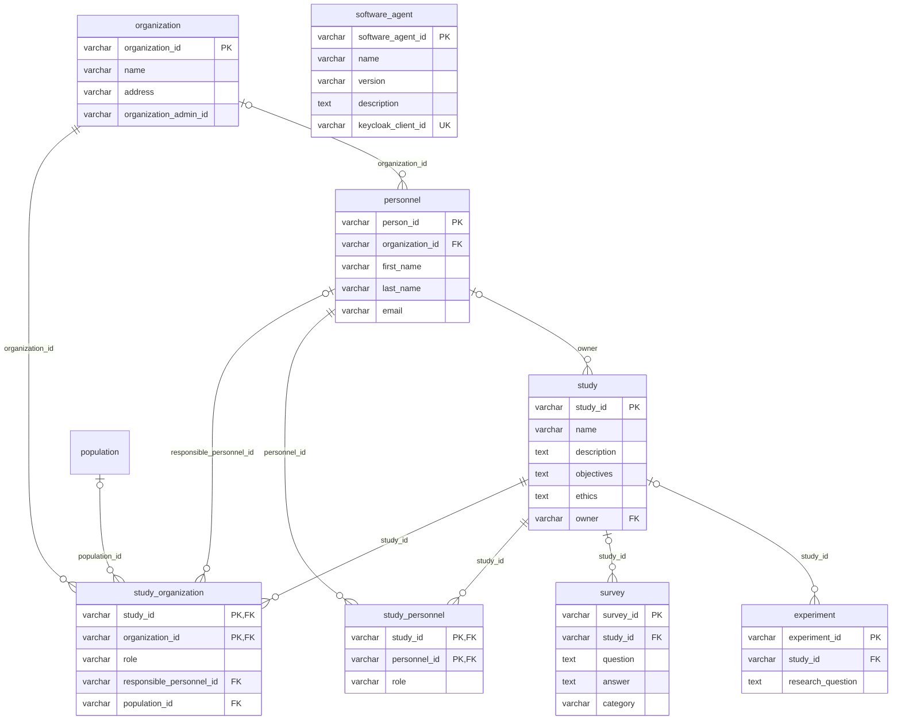
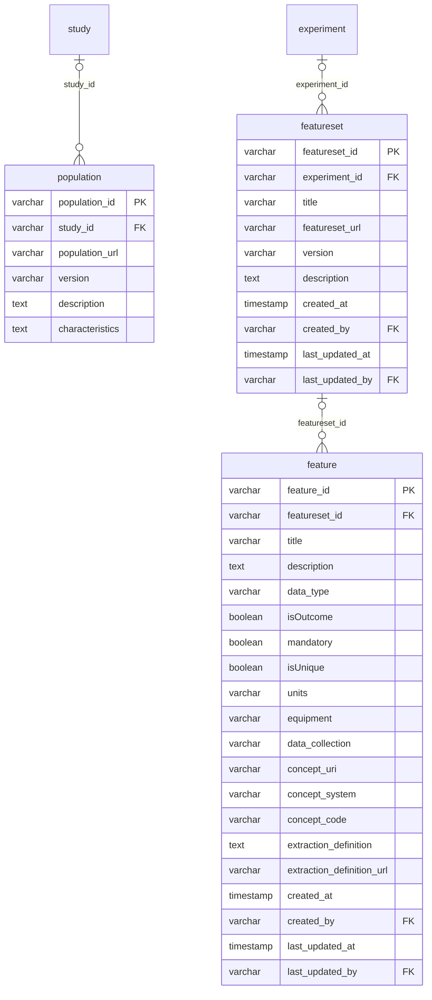
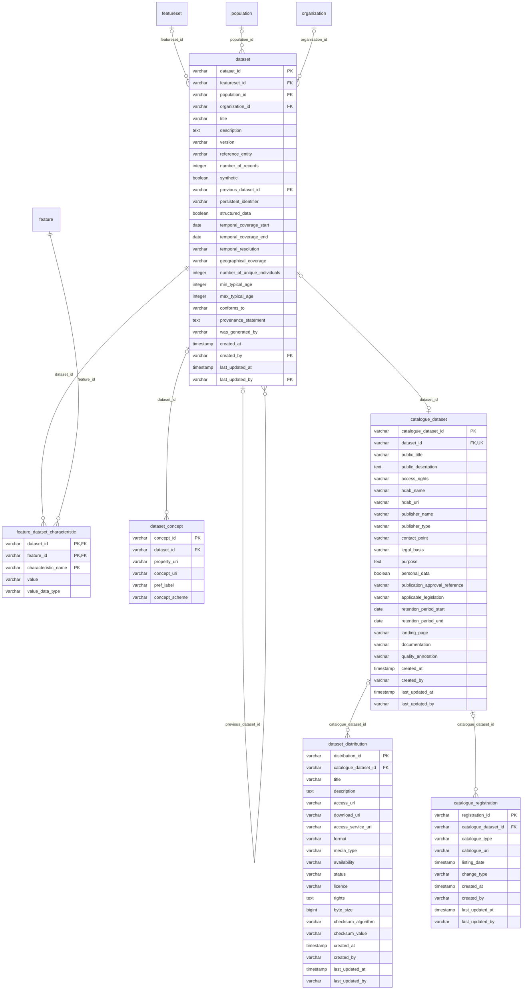
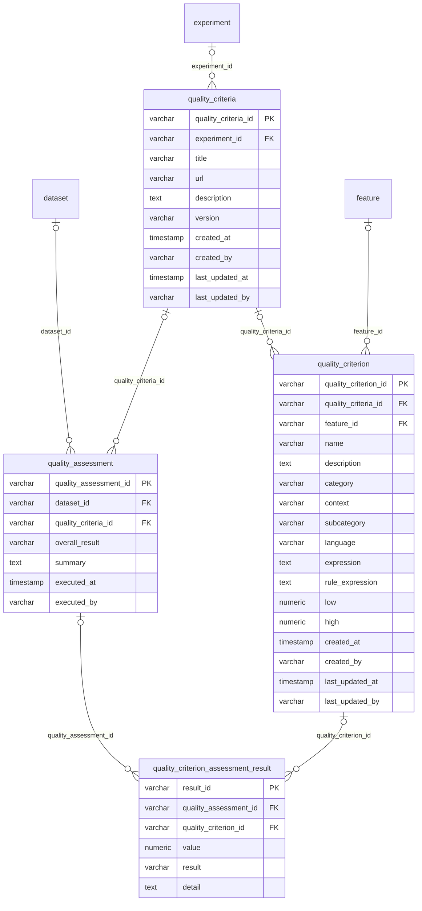
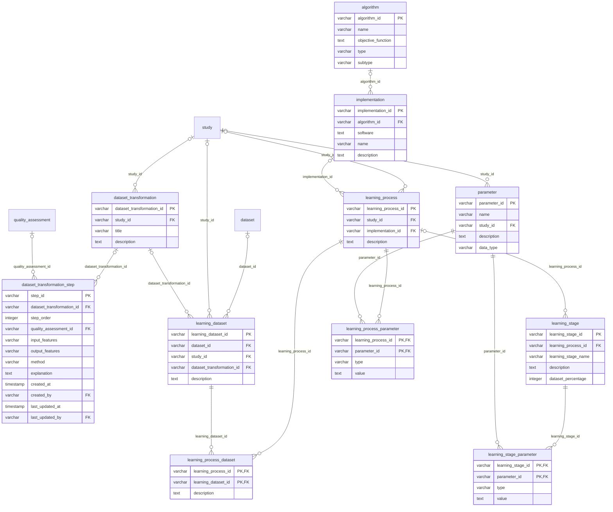
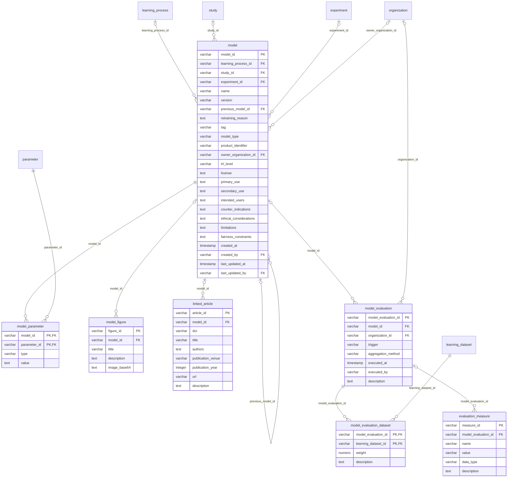
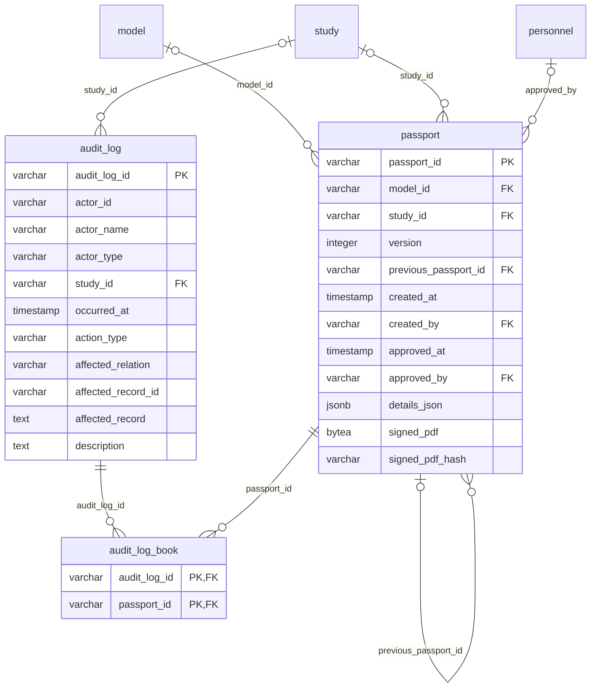

# Passport data model

<!-- Generated by generate_er.py from docker/deployment/init-db.sql. Do not edit by hand. -->

42 tables, generated from the DDL in [`docker/deployment/init-db.sql`](../../docker/deployment/init-db.sql), which is the source of truth. After a schema change, regenerate with `python docs/data-model/generate_er.py`.

- Keys are marked `PK`, `FK` and `UK` (unique). Every identifier is a `varchar` UUID.
- `created_by` and `last_updated_by` reference `personnel` from most tables. They are listed as attributes but not drawn, so the real structure stays visible.
- Each relationship is drawn once, in the domain of the table holding the foreign key. Tables from other domains appear there without attributes.

For how the data model fits the wider system, see the [component overview](../architecture/README.md).

## Overview

The seven domains below. An arrow points from a domain to the domains whose tables reference it.

## Study and organization

Who takes part: organizations, their personnel and software agents, the study and its members.

## Cohort and features

The declarative definitions executed by Studyfyr, each identified by (url, version).

## Datasets and publication

Extracted datasets, their statistics and HealthDCAT-AP publication records.

## Data quality

Quality criteria definitions and the assessments run against datasets.

## Training

Learning datasets and their transformations, the learning process, its stages and parameters.

## Model and evaluations

The model with its lineage, parameters, figures and publications, and its evaluation runs.

## Passport and audit

The signed, versioned passport and the audit log it freezes.

